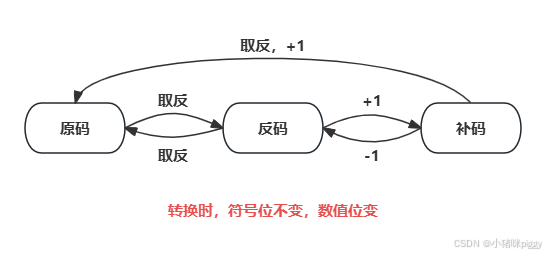

## 计算机基础
### 二进制表示
参考：https://blog.csdn.net/2401_86272648/article/details/140768360

在计算机中，数值一律用‌‌补码‌来表示和存储。补码的使用可以将符号位和数值位统一处理，同时加法和减法也可以统一处理。‌正数的‌原码、‌反码、补码相同‌，而负数的补码是其原码的数值位取反后加1。
1. 原码：原码‌是一种简单的表示方法，其中最高位表示符号（0为正，1为负），其余位表示数值的大小。例如，整数+7的原码为00000111，-7的原码为10000111
2. ‌反码‌：通常用于由原码求补码或由补码求原码的过渡。正数的反码与原码相同，负数的反码是其原码除符号位外所有位取反。例如，+7的反码为00000111，-7的反码为11111000
3. 补码‌：是用于计算机存储和运算的主要形式。正数的补码与其原码相同，负数的补码是在其反码的末位加1。例如，+7的补码为00000111，-7的补码为11111011
#### 取反
参考：https://blog.csdn.net/markzy/article/details/139702687
$$A^{'} = A按位取反+1$$ 

